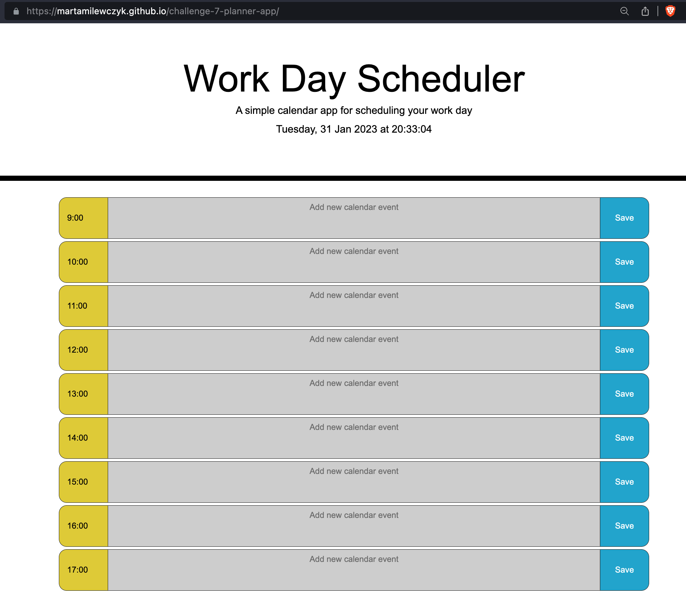

# challenge-7-planner-app
A simple calendar app for scheduling your work day

## Description

Project is a workday planner application. Displays the current day at the top of the calendar when a user opens the planner. Presents timeblocks for standard business hours when the user scrolls down. Color-code is applied to each timeblock based on past, present and future when the timeblock is viewed. Allows a user to enter an event when clicks a timeblock. Saves the event in local storage when the save button is clicked in that timeblock. Persists events between refreshes of a page.

## Installation

Application is deployed in <a href="https://martamilewczyk.github.io/challenge-7-planner-app">Github</a>

## Usage

Application view

## License
Project is licensed under the <a href="LICENSE">MIT License</a>.

---  